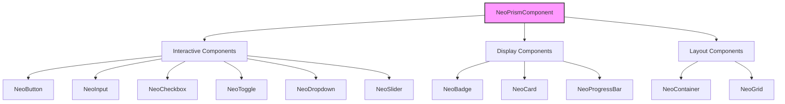
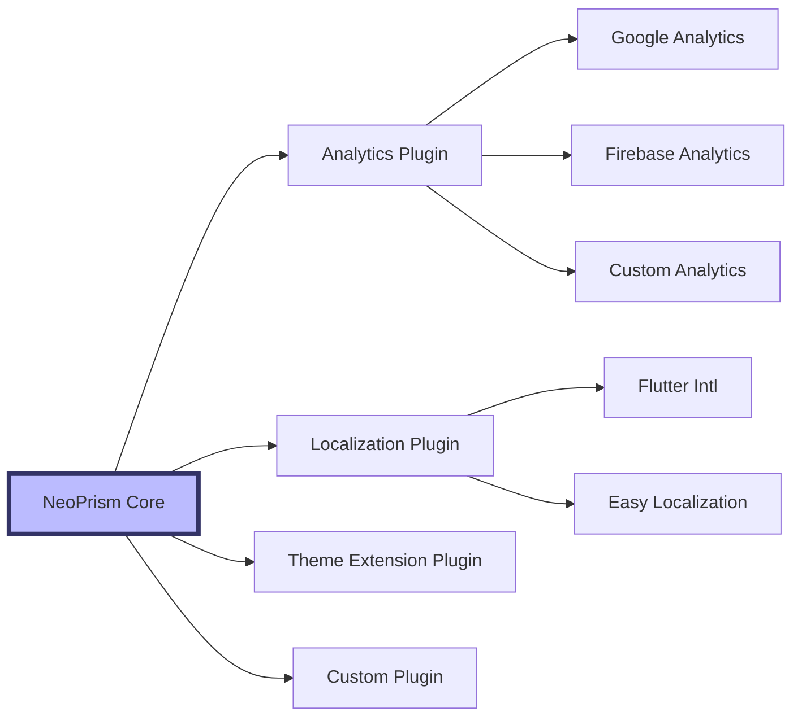
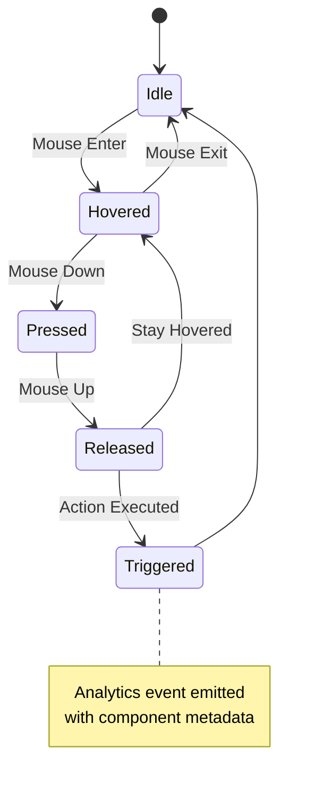
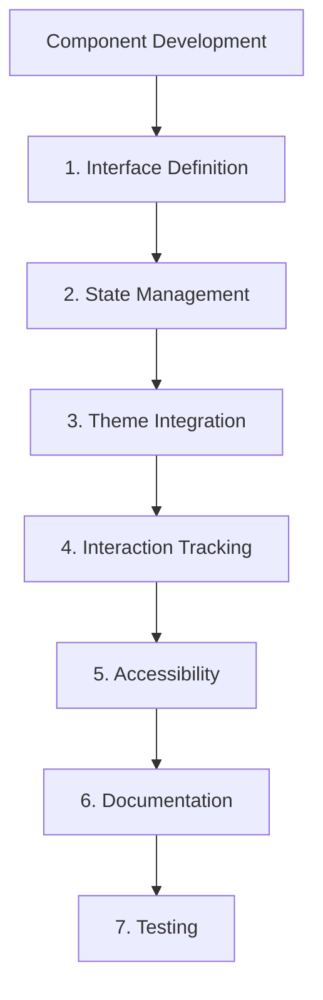
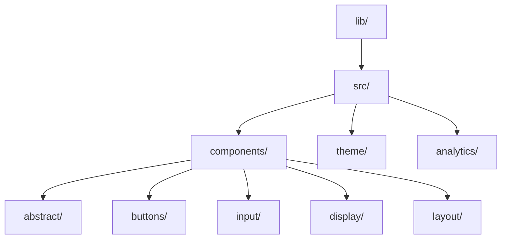
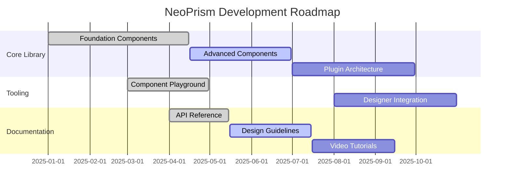

# NeoPrism Labs

## Overview

NeoPrism Labs develops a comprehensive Flutter UI toolkit implementing neobrutalism design principles. Our component libraries feature bold borders, vibrant colors, and interactive shadow effects that create a distinctive visual identity while maintaining production-ready quality standards.

## Architecture Vision

### Component Design Philosophy

Our components follow a structured hierarchy designed for consistency and extensibility:

### Planned Plugin Architecture

Our roadmap includes a pluggable architecture that will enable:

All components emit standardized interaction events that can be captured and processed by analytics plugins, enabling comprehensive user behavior tracking while maintaining separation of concerns.

## Component Lifecycle

Each component implements this interaction lifecycle, providing consistent behavior and predictable analytics events.

## Development Standards

Our components adhere to strict development standards:

### Code Organization

## Current Projects

### Core Library
The foundation of our ecosystem containing all UI components, theming system, and infrastructure.

### Component Playground
An interactive showcase allowing developers to explore and customize components in real-time.

### Documentation Site
Comprehensive documentation with examples, API references, and design guidelines.

## Resources

- **Website**: [neoprismlabs.in](https://neoprismlabs.in)
- **Component Playground**: [playground.neoprismlabs.in](https://playground.neoprismlabs.in)
- **Core Package**: [pub.dev/packages/neoprism_core](https://pub.dev/packages/neoprism_core)
- **GitHub Repository**: [github.com/NeoPrismLabs/neoprism-core](https://github.com/NeoPrismLabs/neoprism-core)

## Contribution Guidelines

NeoPrism Labs welcomes contributions that align with our design philosophy and technical standards. Contributors should:

1. Familiarize themselves with the neobrutalism design principles
2. Follow the established component architecture
3. Include comprehensive documentation and tests
4. Ensure accessibility compliance

## Roadmap

---

© 2025 NeoPrism Labs. All rights reserved.